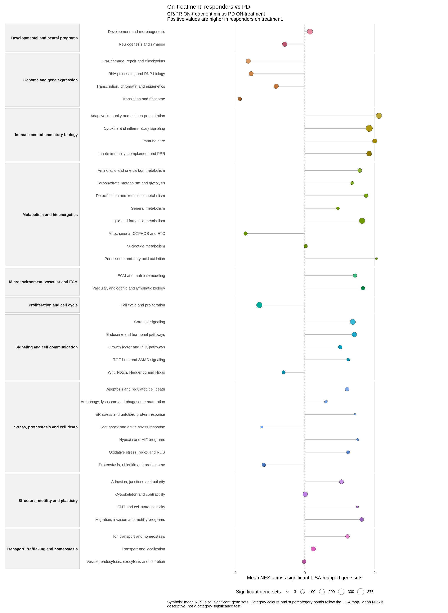

<p align="center">
  <a href="https://olmedalab.org/lisaR/en/">
    
  </a>
</p>

# lisaR

**Analysis and semantic annotation of gene set enrichment results**

lisaR takes previously computed differential expression results, runs gene set
enrichment analysis (GSEA) and groups the results into biological categories.
Its portable report lets you inspect the gene sets and genes behind each
category.

The LISA dictionaries were prepared with the help of large language models.
During your analysis, lisaR applies those fixed assignments locally; it does
not send your data to a cloud-hosted LLM.

## Install lisaR

You need **R 4.1 or later**. Run this in R or RStudio:

```r
install.packages(c("BiocManager", "remotes"))
BiocManager::install("fgsea", update = FALSE, ask = FALSE)
remotes::install_github("DBM-OlmedaLab/lisaR", upgrade = "never",
                        build_vignettes = FALSE)
```

The LISA dictionaries and category hierarchy are included. The example below
prepares the external gene-set memberships and downloads its DE table.

## Run your first analysis: Riaz ON

This example compares CR/PR responders with patients with progressive disease
during nivolumab treatment in
[Riaz et al. (2017)](https://doi.org/10.1016/j.cell.2017.09.028).
It uses DE results prepared from that study; it does not fit DESeq2 again.

Use a short writable root and new `riaz-data` and `riaz-on` directories.
The resource preparation records acceptance of the
[resource terms](https://olmedalab.org/lisaR/reader/resources-and-provenance.html?lang=en).
This is a real-data run: enrichment and figure generation can take time.

<!-- BEGIN RIAZ ON EXAMPLE -->
```r
library(lisaR)

# Use a short, writable path. Change C:/lisa if needed.
root <- if (.Platform$OS.type == "windows") "C:/lisa" else "~/lisa"
root <- path.expand(root)
dir.create(root, recursive = TRUE, showWarnings = FALSE)

# Prepare the human gene-set membership resource once.
prepare_lisa_msigdb_resource(accept_terms = TRUE)

# Download the prepared Riaz data to a new directory.
riaz <- install_lisa_example_bundle(
  "riaz-gse91061",
  destination = file.path(root, "riaz-data")
)

# Analyse ON only: CR/PR responders versus PD during treatment.
result <- run_lisa(
  de = list(responders_vs_pd_on = file.path(
    riaz$bundle, "outputs", "lisa_inputs", "responders_vs_pd_on.tsv"
  )),
  output_dir = file.path(root, "riaz-on"),
  species = "Homo sapiens",
  method = "DESeq2",
  positive_direction =
    "Higher in CR/PR responders than in PD during treatment",
  mode = "standard"
)

stopifnot(identical(result$gate, "PASS"))
browseURL(result$report_index)
```
<!-- END RIAZ ON EXAMPLE -->

## Explore the report

Select **responders_vs_pd_on**, open a LISA plot and click a category to inspect
its member gene sets. Positive NES values point towards responders.
The example below shows category mean NES, a descriptive summary rather than
a category significance test.

<a href="vignettes/figures/riaz-category.png">
  
</a>

The report includes PNG and SVG figures, source tables and R recipes.
Keep the whole output folder when sharing it with a colleague.

## Continue with your own data

**[Follow the documentation](https://olmedalab.org/lisaR/reader/documentation.html?lang=en)**:
install, run Riaz ON, use your own DE and read the report.
Advanced methods and configuration are available separately from that route.

## Licence and citation

lisaR is free software under **GPL-3.0-or-later**, authored by David Olmeda
Casadomé. Copyright: Agencia Estatal Consejo Superior de Investigaciones
Científicas (CSIC). External resources retain their own terms.

[Licence and citation](https://olmedalab.org/lisaR/reader/licence-and-citation.html?lang=en) ·
[Report an issue](https://github.com/DBM-OlmedaLab/lisaR/issues)
