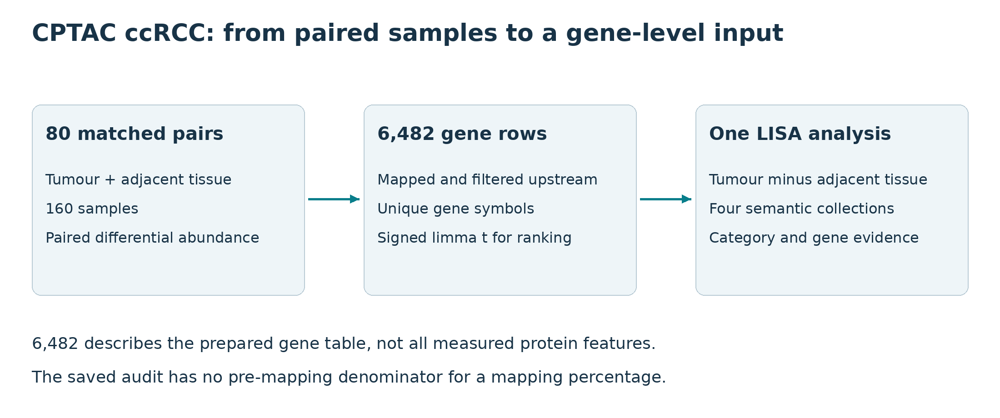
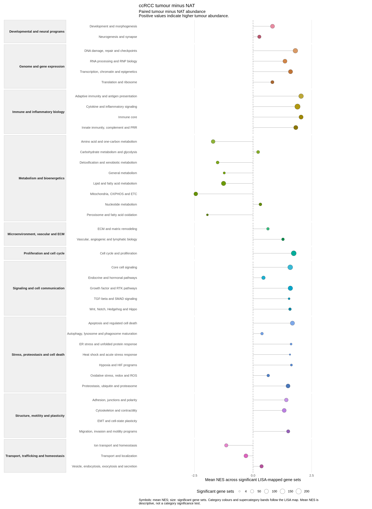

This example asks which programmes are enriched in clear cell renal cell
carcinoma (ccRCC) relative to adjacent renal tissue. It starts from a frozen,
paired global-proteomic differential-abundance table for **80 matched pairs**:
one tumour and one adjacent non-tumoral renal-tissue sample per patient, 160
samples in total. NAT means adjacent non-tumour tissue here. It does not mean
healthy donor kidney.

The source study is Clark DJ, Dhanasekaran SM, Petralia F, et al. *Integrated
Proteogenomic Characterization of Clear Cell Renal Cell Carcinoma*. Cell
2019;179:964-983, CPTAC ccRCC (PDC000127). The reviewed example bundle contains
derived inputs and audit records, not the original abundance matrix.

## Know what was prepared upstream

  
*Input scope of the prepared CPTAC example. Protein-to-gene mapping, filtering
and paired modelling take place upstream of lisaR.*

The supplied primary table has 6,482 usable, unique gene-symbol rows for the
80-pair comparison. Its declared effect is `tumor_minus_nat`, so a positive
value means higher tumour abundance. The ranking column is the moderated
limma `t` from the upstream paired model. `p_value` and
`fdr_bh_all_genes` remain in the table. lisaR uses the full ranked table and
does not refit limma or pre-filter genes by significance for this route.

Protein measurements were mapped to gene identifiers and filtered before this
input was exported. The useful coverage for this example is therefore the
number of usable mapped gene rows, not a count of all originally measured
protein features. The frozen input audit records zero duplicate Entrez IDs,
zero missing Entrez IDs and zero non-finite values in the required numeric
columns. It does not establish the total number of protein features before
mapping, how many-to-one mappings were resolved or how many features were
discarded at each filter. A mapping percentage or protein-level coverage claim
cannot be recovered from 6,482 gene rows alone.

The `global proteomic` profile configures warnings below 500 usable features
and below 1,500 usable features. These are operational warning thresholds,
not validated scientific minima. A targeted panel has a limited feature
universe and needs its own coverage assessment; it is not represented by this
global-proteomic example. Tumour tissue and adjacent tissue also differ in
cellular composition, which this prepared differential-abundance table does
not resolve.

Use a short writable project root. The examples below use `D:/lisa` on
Windows; change the drive if needed. Avoid nesting the project under several
long folder names. Preparation creates `study.yml`, short inputs under `data/`
and a `provenance/path_map.tsv` linking them to their original names and hashes.
Results go to `out/`. Scientific comparison names and directions are unchanged.

## 1. Obtain the reviewed bundle

Install lisaR first with [Installation](installation.html), then make the
external membership resource available through
[Resources and provenance](resources-and-provenance.html). Obtain the
reviewed input bundle in a new destination:

```{r obtain-cptac-bundle, eval=FALSE}
library(lisaR)
root <- if (.Platform$OS.type == "windows") "D:/lisa" else "~/lisa"
root <- path.expand(root)
dir.create(file.path(root, "bundles"), recursive = TRUE, showWarnings = FALSE)

bundle <- install_lisa_example_bundle(
  "cptac-ccrcc",
  destination = file.path(root, "bundles", "cptac")
)
bundle$next_command
```

The default source is a versioned public release in
`DBM-OlmedaLab/lisaR-example-data`. The installer verifies the pinned archive and
the six-file member manifest before promoting it. A verified cached archive
can be reused offline. The bundle contains the primary table and five audit
files, but acquiring it does not run lisaR.

`bundle$next_command` is a complete POSIX shell command with prepare-only mode
enabled. To prepare from R or RStudio using the current R installation:

## 2. Create and check the prepared project

```{r prepare-cptac-project, eval=FALSE}
project <- normalizePath(file.path(root, "cptac"),
                         winslash = "/", mustWork = FALSE)
Sys.setenv(
  LISAR_CPTAC_CCRCC_BUNDLE = bundle$bundle,
  LISAR_CPTAC_CCRCC_PROJECT_DIR = project,
  LISAR_CPTAC_CCRCC_PREPARE_ONLY = "1"
)
prepare_script <- system.file("examples", "cptac-ccrcc",
  "prepare_and_run_cptac_ccrcc.R", package = "lisaR")
status <- system2(file.path(R.home("bin"), "Rscript"),
                  c("--vanilla", shQuote(prepare_script)))
Sys.unsetenv("LISAR_CPTAC_CCRCC_PREPARE_ONLY")
stopifnot(status == 0L)
```

Preparation verifies and copies the inputs, resolves resources, validates and
plans the project, then reports `CPTAC_CCRCC_LOCAL_ROUTE=PREPARE_ONLY_PASS`.
It performs no new differential-abundance fit and does not call `run_lisa()`.
The promoted directory is an execution-ready prepared project, not a completed
scientific result.

## 3. Inspect the configuration and its output plan

```{r inspect-cptac-example, eval=FALSE}
config <- file.path(project, "study.yml")
study <- yaml::read_yaml(config)
print(study$pipeline)
print(data.frame(
  analysis = study$single_de[[1]]$analysis_id,
  comparison = study$single_de[[1]]$comparison,
  positive_direction = study$single_de[[1]]$positive_direction,
  rank_column = study$single_de[[1]]$rank_col
))
validation <- validate_lisa_config(config, check_files = TRUE)
stopifnot(validation$execution_ready)
output_plan <- plan_lisa_outputs(config)
print(output_plan$summary)
```

This inspection and `plan_lisa_outputs()` describe the intended products. They
do not execute GSEA. Check that the analysis is
`cptac_ccrcc_tumor_minus_nat`, the effect direction is tumour minus NAT and the
ranking column is `t` before proceeding.

## 4. Run, verify and recognise the result

```{r run-cptac-example, eval=FALSE}
result <- run_lisa(config)
check <- verify_lisa_run(result$output_dir)
stopifnot(identical(result$gate, "PASS"), identical(check$gate, "PASS"))
print(result$output_dir)
browseURL(file.path(result$output_dir, "report_index.html"))
```

The generated configuration has one DE analysis,
`cptac_ccrcc_tumor_minus_nat`, and **no LISA profile contrast in this example**.
It uses `global proteomic`, one worker, the four semantic collections and the
resource identities `lisa_dictionary_core@1.0.0`, `msigdb_term2gene@2026.1` and
`lisa_category_map@1.0.0`. Hallmarks, ORA and native KEGG maps are disabled.
This is a choice for the example, not a restriction on proteomic studies in
lisaR.

A successful run is written to
`project/out`. Verification must report
gate `PASS`. In the report, positive NES follows the prepared tumour-minus-NAT
ranking. No responder grouping, healthy-donor comparison or protein-level
model has been added by lisaR.

STANDARD provides category plots and linked gene-set/gene evidence. The
[report guide](scientific-report.html) shows how to add selected presentation
products to a completed run without repeating enrichment.

  
*A saved CPTAC category overview. Each point shows the mean NES of significant
unique member gene sets (GSEA adjusted P at or below 0.25); its size records
their count. Positive NES follows tumour minus adjacent tissue. Colours and
bands organise categories and supercategories. These are descriptive category
summaries, not category-level significance tests.*

[Full-size PNG](figures/cptac-category.png),
[source table](figures/cptac-category_source.tsv) and
[figure settings](figures/cptac-category_settings.json).

## Optional upstream reconstruction

The prepared example bundle includes the DE table, not an executable
reconstruction from raw mass spectra. A defensible upstream rebuild starts
from an authorised processed abundance matrix and sample annotations from
[CPTAC/PDC](https://pdc.cancer.gov/pdc/study/PDC000127). Reproduce the 80-pair
selection, specify the paired limma design and preserve the protein-to-gene
mapping, collision handling, filtering and missing-value decisions before
exporting a complete ranked table. The supplied audit files identify the
prepared input, but do not replace those source materials. This separate task
is not run by the example preparer, and the guide does not claim a route from
raw mass spectra.

## What the five audit files document

The prepared project carries the primary DE table with five audit records:
the matched-pair sample receipt, primary QC, data-quality summary, input
provenance and the 80-pair list. They establish the input contract for this
example. They do not substitute for access conditions, clinical context,
sample processing information or an independent reanalysis of the source
proteomics.

For another proteomic study, preserve the upstream mapping record, the number
of measured features, the number retained after mapping and filtering, the
duplicate policy, and missing-value handling with the prepared DE result. The
[Preparing DE inputs](preparing-de-inputs.html) guide describes the general
prepared-input contract.
