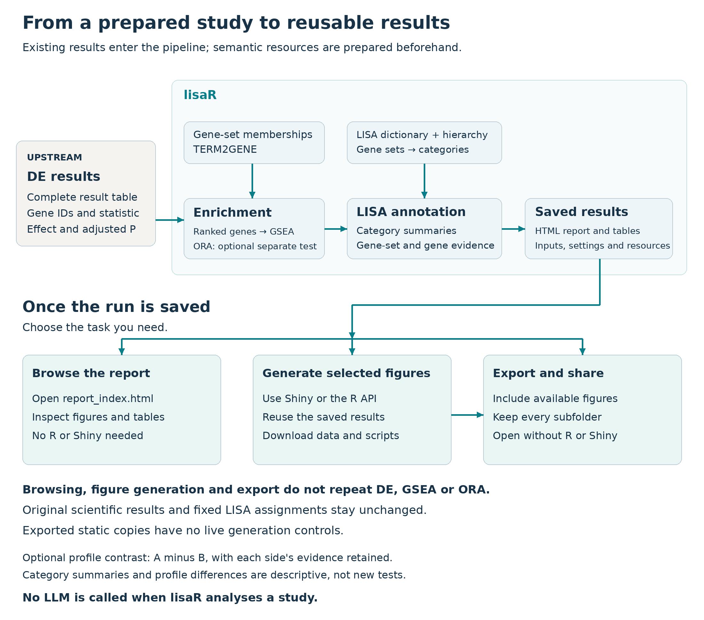

LISA means **LLM-Inferred Semantic Annotation**. lisaR uses a LISA dictionary
to organise gene-set enrichment results into broader biological themes. The
dictionary is prepared before your study is analysed. During an ordinary run,
lisaR applies the saved assignments locally and does not ask a language model
to classify your results.



*Differential expression is calculated upstream. lisaR runs the selected
gene-set analyses, organises their results with the dictionary and category map,
then saves the results and report. You can browse, generate selected figures
or export from that saved run without repeating enrichment or changing its
assignments. A comparison between two completed LISA profiles is descriptive;
it does not fit another differential-expression model.*

[Open the workflow at full size](figures/lisa-workflow.png).

## From gene sets to biological themes

A gene set is a defined group of genes, such as a Gene Ontology term or a named
pathway. GSEA tests each selected gene set against the prepared ranking and
reports quantities such as its normalised enrichment score (NES), adjusted
p-value and leading edge.

LISA adds two levels of organisation:

| Level | Meaning |
|---|---|
| Category | A biological label that brings together related gene sets. |
| Supercategory | A broader group of related categories, used to order and display the report. |

For example, several gene sets can be assigned to one biological category, and
several categories can appear under the same supercategory. A gene set may have
more than one accepted category assignment. These assignments help navigation;
they do not create independent statistical observations.

A category point summarises its significant assigned gene sets. `mean_NES` is
their descriptive mean at the configured GSEA cutoff. It is not a category-level
test. `min_padj` is the smallest adjusted p-value among the member gene sets,
not a category false-discovery rate.

A separate category-inference layer assesses statistical support using raw
gene-set P values. The category card reports its adjusted P and a lower bound
on the number of enriched member sets. These do not turn mean NES into a
significance test or establish a difference between conditions. See
[Statistical analysis](statistical-analysis.html) for the method, hypothesis
family and interpretation of d/N.

## The resources have different jobs

lisaR keeps biological membership and semantic organisation separate:

| Resource | What it supplies |
|---|---|
| TERM2GENE | The genes belonging to each gene set used by GSEA. |
| LISA dictionary | The accepted links from exact gene-set identifiers to categories. |
| Category map | Category names, their display order and their supercategories. |

The package includes core and expanded LISA dictionaries together with the
category map. TERM2GENE membership for a real study is obtained and registered
separately. A gene set can be tested by GSEA even if it has no LISA category;
the report keeps that unmapped status in its complete tables.

The collection identifiers describe different views of those gene sets:

| Identifier | What it covers |
|---|---|
| `GOBP-C2` | GO Biological Process together with selected curated pathways from MSigDB C2:CP. |
| `GOMF` | GO Molecular Function, describing molecular activities. |
| `GOCC` | GO Cellular Component, describing cellular locations and complexes. |
| `PATHWAYS` | A stricter signalling view of the GOBP-C2 gene-set space. |

`HALLMARKS` is a direct gene-set collection, not another LISA category
universe. Its results retain the original gene-set names rather than using
the semantic category assignments above.

## How the built-in dictionaries were constructed

The official LISA categories and gene-set assignments were defined before any
reader's study was run. For the GO-based collections, predefined category
descriptions and gene-set metadata were presented for annotation. Separately
recorded biological-fit scores from Qwen3.5, Gemma4, Mistral3.2 and Phi4-14b
were then combined by the documented GO-family selection rule. Qwen3.5 and
Gemma4 formed the anchor pair, while Mistral3.2 and Phi4-14b supplied supporting
scores. The construction records also identify how missing scores were handled
and where a small set of GOMF assignments received manual corrections.

In this context, a high score meant that a gene set fitted the category's
biological definition under its collection-specific rubric. For example, the
GOMF rubric used 3 for a major function and 4 for a primary or canonical
function, whereas GOCC assessed compartment identity. Under the ordinary rule,
before any recorded manual correction,
an assignment with anchor scores of 4 and 3 reached the core tier only when at
least one supporting score was also at least 3. An assignment with both anchor
scores of 3 reached the expanded tier, but not core.

PATHWAYS was built later with a different, name-first rule. A pathway's name
had to support the biological assignment; gene overlap alone was not enough.
The PATHWAYS selection therefore cannot be described as a simple reuse of the
GO-family rule.

The construction scores were ordinal judgements of biological fit. They were
not probabilities, votes, GSEA weights or measurements from a study. The core
dictionary retains the more stringent accepted assignments. The expanded
dictionary contains those assignments plus the next accepted tier. Current
runtime dictionaries keep the tier and gene-set-to-category links, not the
historical construction score.

Some historical limits remain. The available records support the selection
rules and their link to the distributed assignments, but they do not provide a
complete original prompt and response trail for every GO annotation. The
original MSigDB retrieval release is also unrecorded. These limits concern
historical reconstruction, not the need for an LLM during analysis.

The [dictionary construction guide](dictionary-construction.html) gives the
selection rules, the recorded corrections and the sources behind them. Use it
to examine how an assignment entered core or expanded; you do not need to
repeat that construction to analyse a study.

## Built-in and custom dictionaries are different

The built-in dictionaries are fixed package resources. Choosing core or
expanded selects one of those reviewed assignment sets; it does not rebuild the
dictionary.

A custom dictionary is useful when your study needs a different biological
classification, for example a laboratory-specific category system or a
specialised collection. A custom bundle supplies its own gene-set-to-category
table, category map and compatible TERM2GENE membership. It receives a separate
resource identity and does not replace or silently modify a built-in dictionary.

The [Custom dictionaries and supercategories](custom-dictionaries-and-supercategories.html)
guide shows the required table relationships and how to validate, register and
select a custom bundle.

## What happens during a study run

Differential expression is prepared upstream. Each analysis declares its
comparison and what a positive signed ranking value means. A positive NES means
enrichment towards that declared end of the ranking; it has no
direction-independent biological meaning.

lisaR runs GSEA on the selected TERM2GENE membership, applies the chosen
dictionary and writes the report. Over-representation analysis (ORA) is an
optional analysis of a thresholded gene list and background. Its overlap counts
and adjusted p-values are different from GSEA quantities and leading edges.

The report keeps the underlying GSEA results, complete differential-expression
records where supplied and gene-set memberships alongside the category views.
This lets you move from a category summary back to the gene sets and genes that
contribute to it.

## Reuse a saved result without rerunning the analysis

A saved standard report can be opened in a browser and explored without R. Keep
the report folder together so that its pages, figures and downloads retain
their relative links. The [static report guide](scientific-report.html)
explains the category views, evidence tables and existing downloads.

For interactive work, open the saved run in R or RStudio:

```{r open-shiny, eval=FALSE}
library(lisaR)
explore_lisa_run("path/to/the/saved-run")
```

The Shiny interface lets you browse the saved report and choose the figure you
want to generate. Use **Generate** for that specific request. Opening a
category, searching for a gene or changing a selection does not generate a
figure. The generated figure can include image, data and R-script downloads
where available.

Saving an expanded report copies the standard report together with figures that
were already available when export began. The copied `report_index.html` can
then be opened without R or Shiny. Live Shiny controls are not part of that
static copy. These actions do not recompute differential expression, GSEA or
ORA, and they do not modify the original saved analysis. See the separate
[Shiny guide](shiny-app.html) for the current workflow.

## KEGG gene sets and native pathway maps

KEGG-derived gene sets in TERM2GENE can contribute to enrichment like other
selected gene sets. A native KEGG pathway map is a separate optional product
that needs an authorised local snapshot. Having KEGG gene-set memberships does
not itself provide that map or permission to retrieve one.

Continue with [Quick Start](quick-start.html) for the installed sample
project, [Preparing DE inputs](preparing-de-inputs.html) for your own results or
[Resources and provenance](resources-and-provenance.html) for external
memberships and their terms.
