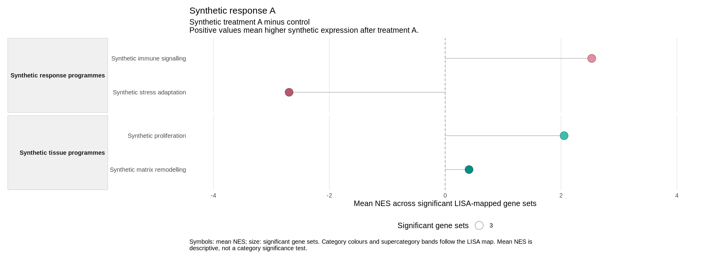

This is the offline synthetic demonstration. For a first real-data analysis,
follow [Riaz ON](riaz-on-quick-start.html).

This guide creates a complete report from the synthetic sample project
included with lisaR. You will copy the project, check its configuration, run it
and open the result in a browser. No study data or resource download is needed
after lisaR is installed.

The example contains 40 synthetic genes, two differential-expression analyses
and one descriptive comparison of their LISA profiles. It demonstrates the
workflow, not a biological finding.

Install lisaR and its dependencies first. See
[Install lisaR](installation.html). Then run the following sections in order in
R or RStudio.

## 1. Create a fresh sample project

`lisa_init_project()` copies the sample input files into a new directory. It will
not overwrite a directory that already exists.

```{r initialise, eval=FALSE}
library(lisaR)

root <- if (.Platform$OS.type == "windows") "D:/lisa" else "~/lisa"
dir.create(path.expand(root), recursive = TRUE, showWarnings = FALSE)
project <- lisa_init_project(file.path(root, "sample"))
```

If you have already used that name, choose a new one, such as
`"sample-2"`. Do not delete or overwrite an earlier project just
to repeat this guide.

The copied `study.yml` selects a standard report. It contains two synthetic
analyses:

- **Synthetic response A:** treatment A minus control, with positive values
  meaning higher synthetic expression after treatment A.
- **Synthetic response B:** treatment B minus control, with positive values
  meaning higher synthetic expression after treatment B.

It also compares the completed response A and response B profiles. A positive
value in that comparison means a larger mean NES in response A. This is a
descriptive profile comparison, not another differential-expression test.

For this first run, use one worker and include downloadable R scripts with the
figures. Save the adjusted configuration beside `study.yml`, where its
relative input paths remain valid.

```{r configure, eval=FALSE}
study <- yaml::read_yaml(file.path(project, "study.yml"))
study$pipeline$workers <- 1L
study$report$recipes <- TRUE
config <- file.path(project, "run.yml")
yaml::write_yaml(study, config)
```

The project uses the semantic collections `GOBP-C2`, `GOMF`, `GOCC` and
`PATHWAYS`. Its sample resources are included in the project.

## 2. Check the configuration

Validate the files and resources before starting the enrichment:

```{r validate, eval=FALSE}
validation <- validate_lisa_config(config, check_files = TRUE)
validation$execution_ready
```

Continue only when this prints `TRUE`. If it prints `FALSE`, inspect the
readiness summary and the relevant input, dependency or resource table:

```{r diagnose, eval=FALSE}
validation$readiness
validation$inputs
validation$dependencies
validation$resources
```

The 40-gene universe is intentionally small, so the sample configuration
records why the usual sufficiency warning is ignored. Do not copy that setting
into a real study without a study-specific reason.

You can also inspect what lisaR plans to produce. Planning does not run the
enrichment.

```{r plan, eval=FALSE}
plan <- plan_lisa_outputs(config)
plan$summary
plan$products
```

## 3. Run and verify the report

```{r run, eval=FALSE}
result <- run_lisa(config)
result$gate
```

Continue when the result is `"PASS"`. If the command stops or returns a different
status, keep the error message and output folder and follow the
[troubleshooting guide](troubleshooting.html) before continuing.

Now check the saved report and its files:

```{r verify, eval=FALSE}
check <- verify_lisa_run(result$output_dir)
check[c("gate", "artifact_type")]
```

The expected values are `"PASS"` and `"scientific_run"`. If they differ, inspect
`check$findings` and resolve the reported problem before opening or sharing the
report. Keep the generated tables unchanged while investigating.

## 4. Open and recognise the result

```{r open, eval=FALSE}
browseURL(file.path(result$output_dir, "report_index.html"))
```

Open **Synthetic response A**, then the **GOBP-C2** category plot.



*Each point is the mean NES of the significant member gene sets assigned to a
category. Point size shows how many significant gene sets contribute. Positive
values mean enrichment towards synthetic treatment A relative to control.
Category colours and supercategory bands organise related biological themes.
The mean is descriptive, not a category-level significance test. This saved
illustration shows the descriptive plot; it is not a four-star inference figure.*

In the generated report, the separate **Category significance** view shows
adjusted-P stars when inference is evaluable, with `****` reserved for
P ≤0.0001. Its category card shows the exact adjusted P, minimum supported
count d/N and coverage. An unmarked category is not necessarily a negative
finding; inspect its status. The A/B profile comparison remains descriptive.

Use the **Section** selector to open **Category evidence**, then choose
**Synthetic immune signalling** in the **Category** selector. This page lists
the member gene sets and their leading-edge evidence. Follow its gene-evidence
links to the corresponding differential-expression and membership records. The
[static report guide](scientific-report.html) explains the views, downloads and
portable report folder. The separate [Shiny guide](shiny-app.html)
shows how to request selected figures from a saved analysis without rerunning
differential expression, GSEA or ORA.

For a prepared scientific example, continue to the
[Riaz RNA-seq guide](riaz-gse91061-worked-example.html).

To use your own data, prepare your differential-expression results and configuration files following the [input preparation guide](preparing-de-inputs.html).
