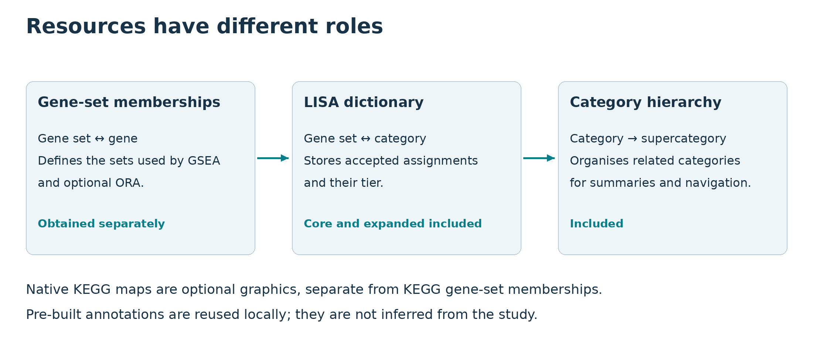

Start by deciding whether you are practising with the synthetic Quick Start or
preparing a real study. Quick Start includes its small sample dictionary,
category map and TERM2GENE table. A real study uses the installed LISA
dictionary and category map, but needs a separate species-matched TERM2GENE
membership resource.

## Decide which resources your study needs

| Resource | Supplied with lisaR? | Needed for a real study? | Purpose |
|---|---|---|---|
| Core LISA dictionary | Yes | Yes, unless you select the bundled expanded dictionary or a reviewed custom dictionary | Assigns exact gene-set identifiers to core LISA categories. |
| Expanded LISA dictionary | Yes | Optional alternative to core | Includes the core assignments and the next accepted assignment tier. |
| LISA category map | Yes | Yes for semantic LISA collections | Names and orders categories and groups them into supercategories. |
| Species-matched TERM2GENE membership | No | Yes | Defines which genes belong to each gene set used by GSEA. |
| Native KEGG map snapshot | No | Optional | Supplies authorised KGML and base-map material for native pathway painting. |

The package also contains synthetic sample and format-validation resources.
They let you practise without provider access, but they are not memberships
for an unrelated study.

  
*lisaR combines a fixed gene-set-to-category assignment with a separate
gene-set-to-gene membership table. A native KEGG snapshot is needed only for
optional pathway painting. The diagram shows resource roles, not scientific
measurements or redistribution rights.*

## Keep resource identities and schemas separate

| Configuration field | Current standard identity | Installed schema |
|---|---|---|
| `dictionary_resource` | `lisa_dictionary_core@1.0.0` | `lisa_dictionary@2` |
| `term2gene_resource` | `msigdb_term2gene@2026.1` | `term2gene@1` |
| `category_map_resource` | `lisa_category_map@1.0.0` | `category_map@1` |

The active expanded identity is
`lisa_dictionary_expanded@1.0.0`. The dictionary's `1.0.0` is its
first-publication resource version. It is not the `lisa_dictionary@2` file
schema, the lisaR package version or the external MSigDB `2026.1` release.
Keep these version spaces separate when recording a study.

A resource ID selects immutable registered bytes. It does not accept a
provider's terms or grant access or redistribution rights. The LISA dictionary
contains gene-set-to-category assignments. TERM2GENE contains gene-set-to-gene
memberships. lisaR runs GSEA with the latter and applies semantic organisation
with the former.

For the recorded construction history and its limits, see
[How LISA dictionaries were built](dictionary-construction.html). The current
technical reconstruction uses MSigDB 2026.1. The original historical
annotation retrieval release was not recorded, so the reconstruction must not
be presented as that missing historical release.

## Obtain and register the MSigDB membership

`prepare_lisa_msigdb_resource()` supports the pinned Homo sapiens H, C2 and C5
MSigDB 2026.1 route. Before allowing it to acquire the archive, review the
[MSigDB terms and collection-specific conditions](https://www.gsea-msigdb.org/gsea/msigdb_license_terms.jsp),
the [KEGG terms](https://www.kegg.jp/kegg/legal.html), and the BioCarta
conditions linked from the MSigDB terms.

Only after you have reviewed and accepted the applicable conditions for your
institution and intended use, run:

```{r obtain-register-msigdb, eval=FALSE}
library(lisaR)

msigdb <- prepare_lisa_msigdb_resource(accept_terms = TRUE)
msigdb[c(
  "resource_id", "path", "registry_path", "acquired",
  "source_zip_sha256"
)]
```

The helper acquires only the pinned archive, verifies it, builds the canonical
TERM2GENE table and registers `msigdb_term2gene@2026.1` in lisaR's managed
resource cache. If that exact registered resource already exists, it is reused
without another download or terms assertion.

Setting `accept_terms = TRUE` permits that call's acquisition. It is not a
licence, a permission grant or acceptance for another person.

If you already have an authorised local copy of the exact pinned ZIP, select it
instead:

```{r register-local-msigdb, eval=FALSE}
source_zip <- file.choose()
msigdb <- prepare_lisa_msigdb_resource(source_zip = source_zip)
```

This local route makes no network request and does not request a new terms
assertion. It still checks the fixed archive identity before registration. The
helper is specific to the documented human release. Use the reviewed custom
resource route for another species or another authorised membership table.

## Select the registered resources

Use explicit versioned identities in the study configuration:

```yaml
pipeline:
  dictionary_resource: "lisa_dictionary_core@1.0.0"
  term2gene_resource: "msigdb_term2gene@2026.1"
  category_map_resource: "lisa_category_map@1.0.0"
```

To use the installed expanded assignments, change only `dictionary_resource`
to `lisa_dictionary_expanded@1.0.0`. Keep the core choice unless the broader
accepted tier answers a deliberate study need.

The dictionary identifiers must match the gene-set identifiers present in the
selected TERM2GENE table. The membership must also match the study species and
gene-identifier convention. A registered name alone does not establish that
biological compatibility.

## Validate the resolved selection

Validate the complete study configuration, rather than checking resource files
by hand:

```{r validate-study-resources, eval=FALSE}
validation <- validate_lisa_config(
  "study.yml", check_files = TRUE, strict = TRUE
)

validation$resources[, c(
  "config_key", "configured_id", "resource_id", "species",
  "schema", "sha256", "ready", "message"
)]
stopifnot(validation$resources_ready)
stopifnot(validation$execution_ready)
```

The table distinguishes a missing resource, incompatible species or profile,
invalid schema and identity mismatch. Correct the installation or
configuration named in `message`, then validate again. Do not bypass the
registry by pointing a study at an arbitrary TSV.

## Install a reviewed custom resource

`install_lisa_resource()` registers an already obtained local dictionary,
TERM2GENE table or category map. It requires a reviewed lower-case SHA-256 and
`approved_origin` metadata. The helper does not download data, accept terms or
self-certify unknown bytes.

Follow [Custom dictionaries and supercategories](custom-dictionaries-and-supercategories.html)
for the complete three-table construction, installation and compatibility
check. Prepared Riaz and CPTAC example bundles use the separate
`install_lisa_example_bundle()` route; they are not resource substitutes for
an unrelated study.

## Add optional native KEGG maps

KEGG-derived gene sets can occur in the TERM2GENE membership and contribute to
enrichment. That membership is not a native pathway diagram.

Native painting is a separate optional product. It requires:

- `pipeline.run_kegg_maps: true`;
- `pipeline.kegg_access_mode: cache_only`;
- an existing local `pipeline.kegg_cache_root`; and
- an immutable `pipeline.kegg_snapshot_id`.

lisaR verifies the declared snapshot and its per-resource identities. It does
not fetch a native map automatically and provides no public snapshot
installer. Obtain and use the snapshot through a route authorised for the
recipient's institution and purpose. If you do not have one, leave native maps
disabled; KEGG gene-set enrichment remains a separate product.

## Keep provenance with the completed run

A completed run records resolved identities in `resource_inventory.tsv` and
`config/resource_resolution.tsv`, alongside its run manifest and technical
environment records. Keep these files with the report.

Category-inference products also record their saved gene-set input identities,
the Hommel method/version and the per-analysis family. A presentation refresh
creates a new manifest-verified copy and keeps the original source-run identity;
it does not replace the source or calculate new P values. Retain both the
source and derived-copy manifests when auditing a four-star report. Resource
SHA-256 values identify bytes, not the validity of a biological conclusion.

The installed package also carries its resource manifest, migration ledger and
provenance statement:

```{r locate-resource-provenance, eval=FALSE}
system.file(
  "extdata", "dictionaries", "RESOURCE_BUNDLE_MANIFEST.tsv",
  package = "lisaR"
)
system.file(
  "extdata", "dictionaries", "RESOURCE_PROVENANCE.tsv",
  package = "lisaR"
)
system.file(
  "extdata", "dictionaries", "RESOURCE_MIGRATION_MANIFEST.tsv",
  package = "lisaR"
)
```

These records identify what was used. They do not establish biological
suitability, provider permission or a right to redistribute external material.
For the notices to retain when sharing, continue to
[Licence, attribution and citation](licence-and-citation.html).
