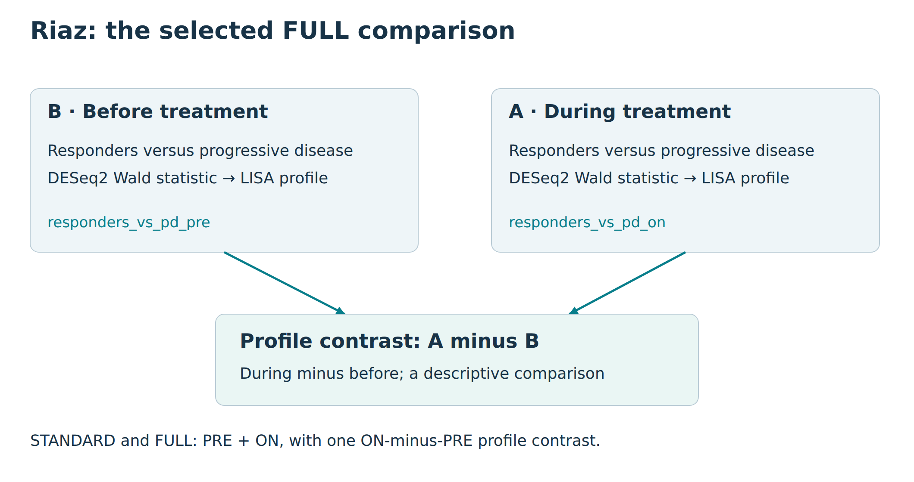

For one DE without a study file, start with [Riaz ON](riaz-on-quick-start.html).
This guide covers the full prepared PRE/ON study.

This example asks how transcriptional programmes differ before and during
nivolumab, both within response groups and between patients with complete or
partial response (CR/PR) and patients with progressive disease (PD). It starts
from reviewed, already fitted RNA-seq results. You can therefore create, plan,
run and recognise the lisaR project without downloading the original study
files or fitting DESeq2 again.

  
*Riaz GSE91061 design. The diagram records the before/during and response-group
structure used by this example; it does not display a result or a biological
measurement.*

The prepared design has 26 complete patient pairs: eight CR/PR and 18 PD. One
before-treatment and one on-treatment sample are retained for each patient.
The accompanying study is Riaz N, Havel JJ, Makarov V, et al. *Tumor and
Microenvironment Evolution during Immunotherapy with Nivolumab*. Cell
2017;171:934-949, [GEO GSE91061](https://www.ncbi.nlm.nih.gov/geo/query/acc.cgi?acc=GSE91061).

## Know which comparison you are running

The prepared tutorial executes two differential expression analyses and one
LISA profile contrast across `GOBP-C2`, `GOMF`, `GOCC` and `PATHWAYS`.

| DE input | Comparison | Upstream model |
|---|---|---|
| `responders_vs_pd_pre` | CR/PR minus PD before treatment | Cross-sectional comparison adjusted for prior ipilimumab |
| `responders_vs_pd_on` | CR/PR minus PD during treatment | Cross-sectional comparison adjusted for prior ipilimumab |

The contrast `response_separation_by_time` compares ON (A) minus PRE (B).
A positive difference means a higher plotted category mean NES during treatment.
This is a descriptive comparison of enrichment profiles, not a fitted
interaction test. Both STANDARD and FULL use these same two analyses and this
one contrast. No other DE analysis must run first. The original bundle retains
additional upstream study results as provenance; the tutorial does not run them.

Use a short writable project root. The examples below use `D:/lisa` on
Windows; change the drive if needed. Avoid nesting the project under several
long folder names. Preparation creates `study.yml`, short inputs under `data/`
and a `provenance/path_map.tsv` linking them to their original names and hashes.
Results go to `out/`. Scientific comparison names and directions are unchanged.

## 1. Obtain the reviewed prepared bundle

Install lisaR as described in [Installation](installation.html), and prepare
the external membership resource as described in
[Resources and provenance](resources-and-provenance.html). Then obtain the
reviewed Riaz bundle in a new destination:

```{r obtain-riaz-bundle, eval=FALSE}
library(lisaR)
root <- if (.Platform$OS.type == "windows") "D:/lisa" else "~/lisa"
root <- path.expand(root)
dir.create(file.path(root, "bundles"), recursive = TRUE, showWarnings = FALSE)

bundle <- install_lisa_example_bundle(
  "riaz-gse91061",
  destination = file.path(root, "bundles", "riaz")
)
bundle$next_command
```

The default source is a versioned public release in
`DBM-OlmedaLab/lisaR-example-data`. The installer verifies its pinned archive and
member checksums before promoting the bundle. A verified cached archive can be
reused offline. This acquisition step does not fit a model or run enrichment.

`bundle$next_command` is a complete POSIX shell command. If you are working in
RStudio, the following R equivalent uses the same active R installation.

## 2. Create the prepared project

```{r prepare-riaz-project, eval=FALSE}
project <- normalizePath(file.path(root, "riaz"),
                         winslash = "/", mustWork = FALSE)
Sys.setenv(
  LISAR_RIAZ_PREPARED_BUNDLE = bundle$bundle,
  LISAR_RIAZ_PROJECT_DIR = project
)
example_dir <- system.file("examples", "riaz-gse91061", package = "lisaR")
rscript <- file.path(R.home("bin"), "Rscript")
prepare_script <- file.path(example_dir, "scripts", "11_prepare_prepared_project.R")
stopifnot(system2(rscript, c("--vanilla", shQuote(prepare_script))) == 0L)
```

Preparation writes the study files and validates their resources without
running GSEA. It reports `RIAZ_PREPARED_PROJECT=PASS`. A new project directory
is required. The installed standard configuration uses `lisa_dictionary_core@1.0.0`,
`msigdb_term2gene@2026.1` and `lisa_category_map@1.0.0`. Older prepared
configurations may retain historical pinned dictionary versions; lisaR reads
those original resources rather than silently replacing them. This is still a
prepared project, not a completed scientific result.

## 3. Inspect the study and its output plan

After preparation, the study file is `study.yml` within
`project`. It requests STANDARD and the four semantic collections, with
Hallmarks and native maps disabled. Inspect the comparisons, readiness and
estimated output before you decide to execute it:

```{r check-riaz-study, eval=FALSE}
config <- file.path(project, "study.yml")
study <- yaml::read_yaml(config)
print(data.frame(
  analysis = vapply(study$single_de, `[[`, character(1), "analysis_id"),
  comparison = vapply(study$single_de, `[[`, character(1), "comparison"),
  positive_direction = vapply(study$single_de, `[[`, character(1),
                              "positive_direction")
))
print(study$collections)
print(study$report)

validation <- validate_lisa_config(config, check_files = TRUE)
stopifnot(validation$execution_ready)
output_plan <- plan_lisa_outputs(config)
print(output_plan$summary)
```

`plan_lisa_outputs()` estimates the intended products. It does not execute the
analysis. The installed stage-09 runner then creates a separate dry-run
configuration, checks that plan, revalidates the unchanged execution
configuration, computes enrichment and verifies the result. It does not refit
DESeq2.

## 4. Run and recognise STANDARD

```{r run-riaz-standard, eval=FALSE}
run_script <- file.path(example_dir, "scripts", "09_run_lisa_example.R")
stopifnot(system2(rscript, c("--vanilla", shQuote(run_script))) == 0L)
browseURL(file.path(project, "out", "report_index.html"))
```

The runner prints `LISA_PLAN_GATE=PASS` after recognising the dry-run directory
as a planning artefact rather than a scientific result. It prints
`LISA_STANDARD_GATE=PASS` only after the scientific run at
`project/out` verifies as a `scientific_run`. Keep that
directory and its saved configuration together.

You should see the PRE and ON analysis identifiers and their single contrast in the
STANDARD report. The category plot below is the saved on-treatment
`responders_vs_pd_on` result for `GOBP-C2`, not the upstream interaction and not
the later A-minus-B profile contrast.

## 5. Assemble the selected integrated FULL report

After a verified standard run is available, the installed selected-report
script creates a new integrated report from saved results. See
[Scientific report](scientific-report.html#assemble-an-integrated-selected-full-report)
for the general saved-result builder. This is distinct
from running `run_lisa()` with a full report mode. The selected-report script
does not refit DE or rerun GSEA. With `--complete-missing true`, it reuses
saved figures and creates only missing presentation products.

```{r build-selected-riaz-full, eval=FALSE}
source_dir <- file.path(project, "out")
output_dir <- file.path(project, "extra")
stopifnot(dir.exists(source_dir), !file.exists(output_dir))
script <- system.file("scripts", "build_selected_LISA_report.R", package = "lisaR")

status <- system2(file.path(R.home("bin"), "Rscript"), c(
  "--vanilla", shQuote(script),
  "--source-dir", shQuote(source_dir),
  "--output-dir", shQuote(output_dir),
  "--analyses", "responders_vs_pd_pre,responders_vs_pd_on",
  "--contrasts", "response_separation_by_time",
  "--complete-missing", "true",
  "--title", shQuote("Response-group separation during and before nivolumab")
))
stopifnot(status == 0L)
browseURL(file.path(output_dir, "report_index.html"))
```

`source_dir` must be the verified standard-result directory and `output_dir`
must be a new directory outside it. The script checks that the selected
contrast refers only to the two selected analyses, retains the saved source
identity, and verifies that the integrated navigation contains exactly the
two named analyses and the `response_separation_by_time` contrast. In that
contrast, the saved during-treatment profile is A and the saved baseline
profile is B. It is not a fresh time-by-response interaction test. Optional
native KEGG maps require their own
authorised local snapshot and are not enabled by this command.

  
*A saved selected-FULL category overview for the on-treatment comparison.
Each point is the mean NES of significant unique member gene sets (GSEA
adjusted P at or below 0.25), with point size showing their count. Positive
NES follows CR/PR minus PD during treatment. Colours and bands organise
categories and supercategories; they do not define a new significance test.*

This archived selected-FULL illustration is descriptive. Its screenshot and
source table do not establish exact identity with the saved category-inference
rows used by a newer STANDARD report, so no adjusted-P stars are overlaid on
this image. In a current verified run, use its own **Category significance**
view and card to read the four-star threshold, exact P and d/N; never infer a
category P from this figure's mean NES or member-set FDR.

[Full-size PNG](figures/riaz-category.png),
[source table](figures/riaz-category_source.tsv) and
[figure settings](figures/riaz-category_settings.json).

## Optional upstream reconstruction

The prepared route is the recommended route when the reviewed bundle is
available. Reconstruction is separate: the installed scripts `00` through
`05` obtain and verify the required original study files, rebuild the paired
cohort and upstream DE outputs, and then feed the ordinary preparation stages.
Stage 00 downloads four GEO files and verifies six publisher supplements
that you obtain separately from [the article](https://doi.org/10.1016/j.cell.2017.09.028); it is not
an alternative source for the prepared bundle and it is not a lightweight
first run.

Use the installed example directory to inspect the reconstruction scripts and
their input contract:

```{r locate-riaz-reconstruction, eval=FALSE}
example_dir <- system.file("examples", "riaz-gse91061", package = "lisaR")
list.files(file.path(example_dir, "scripts"), pattern = "^0[0-5]_", full.names = TRUE)
```

The prepared and reconstruction routes preserve different provenance. Neither
route changes the declared response groups, comparison directions, selected
collections or saved FULL product scope.
