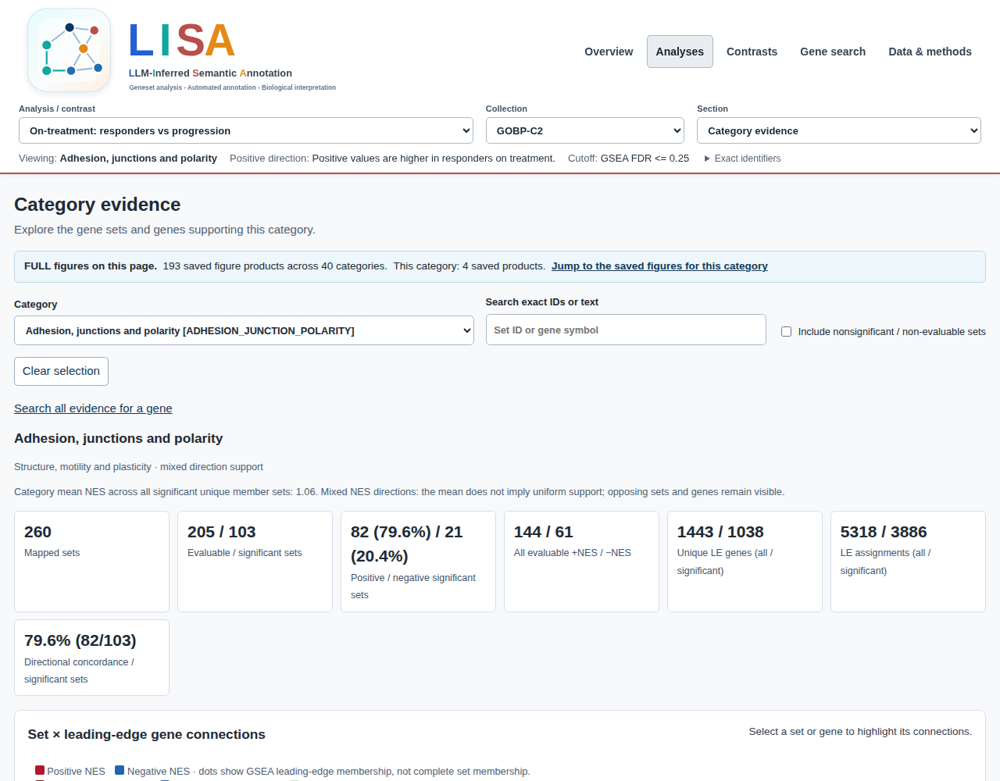

Start with a completed lisaR report folder. You can open it, inspect its saved
evidence and copy it for review without running differential expression, GSEA
or ORA again.

## Open the saved report

Open `report_index.html` inside the saved folder in your browser. You do not
need R to read its pages or use existing downloads. Keep the folder intact
because its pages, figures and downloads use relative paths.

If you produced the analysis, you can verify its original completed folder
in R before sharing or adding figures. The R examples below use that original
folder, not just an exported static copy. Set `run_dir` to the folder, not to
the HTML file:

```{r open-saved-report, eval=FALSE}
run_dir <- "path/to/your/saved-run"
check <- lisaR::verify_lisa_run(run_dir)
stopifnot(identical(check$gate, "PASS"))

browseURL(file.path(run_dir, "report_index.html"))
```

If verification does not pass, inspect `check$findings` before sharing or
extending the analysis.

Most readers start with a saved `report.mode: standard` run. Its overview,
category evidence, gene search and applicable contrast evidence are the normal
scientific report, not a reduced enrichment calculation.

**Overview** shows the number of DE analyses and contrasts, with a card to open
each result. The **Analysis map** below those cards links directly to its
collections. Open **Report details** for summary tables and output counts.

If you do not yet have a completed report, follow [Quick Start](quick-start.html)
or [Run lisaR with your prepared files](getting-started.html). A dry run or
`plan_lisa_outputs()` describes intended products but does not create a
completed scientific report.

## Open category evidence

The shared header links to **Overview**, **Analyses**, **Contrasts**, **Gene
search** and **Data & methods** when those sections are applicable. Status and
coverage tables distinguish completed, not requested, skipped and inapplicable
products. An absent product is not a negative biological result.

| Report area | What it contains | Direct route |
|---|---|---|
| LISA overview | Category plots for each completed analysis and selected collection | In **Section**, select **Category evidence**, then choose a category in **Category**. |
| Category evidence | Exact category scope, mapped sets, leading edges and DE measurements | Use the category page's downloads for its complete tables. |
| Gene search | Per-analysis DE measurements and complete TERM2GENE membership | Follow a category link to retain the same analysis, collection and tier. |
| Contrasts | Aligned A/B category, set and gene evidence | Click a category head or name on the original contrast figure to open its evidence. |
| Data & methods | Configuration, provenance, source data and recipes selected by the output policy | Use the linked files, rather than reconstructing a path from a screenshot. |

For a single analysis, choose the analysis and collection first. In the
**Section** selector, select **Category evidence**, then choose the category in
the **Category** selector. The category PNG is not clickable.

When saved category inference is present, **Category significance** is the
default view. It marks the highest adjusted-P threshold reached: `*` ≤0.05,
`**` ≤0.01, `***` ≤0.001 or `****` ≤0.0001. No star may mean either not
significant or not evaluable. Open **Category evidence** for that status, the
exact adjusted P, minimum supported count **d/N** at 95% simultaneous
confidence, and coverage. The mean-NES panel and profile contrasts remain
descriptive. The SVG, PNG and PDF downloads and the standalone SVG recipe,
where supplied by the output policy, use the same saved P values and legend.
Historical reports without category inference retain descriptive navigation;
their absence of stars must not be interpreted as a negative result.

For a contrast, category names and category heads have separate links that
open the aligned A/B evidence. Both routes retain the selected scope, not only
the rows currently displayed. Where the output policy supplies them, use the
**PNG** link for the static figure and the **R script** link for its companion
recipe. Keep the linked source TSV and settings with either download.


*Category evidence for Adhesion, junctions and polarity in the saved Riaz
on-treatment CR/PR-minus-PD analysis, GOBP-C2. This is an existing selected
FULL report with two analyses and one contrast, not a new calculation. The
analysis and collection selectors keep the current scope visible; the
FULL-figure link leads to saved products for this category. This historical
capture is a navigation example, not evidence of a four-star result.*

From the page shown above, **Search all evidence for a gene** opens the gene
explorer. **Jump to the saved figures for this category** opens its FULL
products; a figure thumbnail opens the available preview. These routes retain
the selected category rather than starting a separate analysis. Products depend on the
inputs and report settings.

## Category and gene evidence

The category-evidence page keeps the distinct data layers separate. Gene-set
NES and GSEA adjusted P values belong to a set. Log fold change and DE adjusted
P values belong to a gene. A leading-edge mark records a contributor for that
GSEA result; complete TERM2GENE membership is broader and remains available in
the gene view.

The evidence matrix has display limits, but its downloadable tables retain the
configured category scope. `tables/sets.tsv` records mapped set states,
`leading_edges.tsv` records the available links, and `genes.tsv` records the
shared DE values for that evidence page. `*_GSEA_universe_ledger.tsv` records
the selected source space, including size-ineligible sets. `GOBP-C2`, `GOMF`
and `GOCC` also have tabular `*_GSEA_OTHER_UNCLASSIFIED.tsv` rows. `PATHWAYS`
does not. These residual rows are not plotted categories.

Gene search starts from a recorded symbol or biological identifier. Its default
membership view uses complete TERM2GENE, not only leading edges. A member can
therefore appear in a significant gene set without being in its recorded
leading edge. The report does not create a combined gene-importance score.

## A/B contrast fields

An A/B contrast aligns existing analysis evidence. `delta_mean_NES` is always
a descriptive comparison. It is not a category-level FDR and not a formal
interaction test. A formal source-model interaction remains gene-level
evidence. The following fields identify the endpoints used by the contrast
plot and table.

| Field | Role |
|---|---|
| `mean_NES_contextual_A` | A-side mean across finite evaluable mapped sets before the cutoff. |
| `display_mean_NES_A` | A-side endpoint actually selected for the plot. |
| `endpoint_source_A` | States whether that endpoint is significant, contextual, unavailable or hidden. |
| `has_significant_support_A` | States whether A has at least one member at `gsea_padj_cutoff`. |
| `plot_has_any_significant_support` | States whether either endpoint may be shown. |
| `gsea_padj_cutoff` | Cutoff shared by the saved support state. |
| `delta_mean_NES` | Displayed A minus B endpoint difference, available only when both endpoints are finite. |

The B-side fields follow the same contract. If one side has significant support,
the other side may use a finite contextual mean and is identified as such. If
neither side has significant support, the plot has no endpoints or delta. A
missing contextual value is not replaced with zero.

## Add one figure with Shiny

For the simplest extension, open the saved report with the optional Shiny
interface:

```{r open-saved-report-shiny, eval=FALSE}
lisaR::explore_lisa_run(run_dir)
```

Open the category or section you need, choose one item and press its
named button, such as **Generate volcano**. This launches a separate figure
worker using saved results. It does not rerun differential expression, GSEA or
ORA, and it does not change the original report. Follow
[Explore a saved report with Shiny](shiny-app.html) for states, downloads,
reuse and expanded export.

## Use R to render a selected extension

`plan_lisa_extension()` and `render_lisa_categories()` are the public route
for selected additions. They consume a completed, checked standard run, use
its saved scientific tables and leave it unchanged. They do not repeat
enrichment.

```{r report-selected-extension, eval=FALSE}
analysis_ids <- read.delim(
  file.path(run_dir, "config", "de_index.tsv")
)$analysis_id
selection <- list(
  selection = list(
    mode = "selected",
    analyses = analysis_ids[[1L]],
    products = c("member_gene_sets", "volcano")
  ),
  report = list(
    mode = "selected",
    formats = list(png = TRUE, svg = FALSE, pdf = FALSE),
    source_data = TRUE,
    recipes = TRUE
  )
)

extension_plan <- lisaR::plan_lisa_extension(run_dir, selection)
extension_plan$expected_files

extension <- lisaR::render_lisa_categories(
  run_dir, selection, "results/study-selected"
)
```

`output_dir` must be a new folder outside the source run. A selection may also
be `"full"` or a YAML/JSON selection file. Planning is read-only; rendering
creates and checks a separate extension report.

## Assemble an integrated selected FULL report

`run_lisa()` with `mode = "full"` (or `report.mode: full` in a study file) writes the integrated FULL
report: one report in the same `output_dir`, with the standard navigation and
every FULL figure alongside the corresponding analysis, collection and
category. Keep that output folder together when you move or share the report.

To assemble a FULL report for a *subset* of the analyses and contrasts of an
existing run, use the installed `build_selected_LISA_report.R` entry point. It reads saved results, makes a new selected project and invokes the
common report generator. The original run stays unchanged. With
`--complete-missing true`, it creates missing presentation products from the
saved data, without fitting DE or repeating GSEA.

Select existing IDs from `run_dir` rather than inventing directory names:

```{r report-integrated-full, eval=FALSE}
source_run <- run_dir
analyses <- read.delim(file.path(source_run, "config", "de_index.tsv"))
contrast_file <- file.path(source_run, "config", "contrast_index.tsv")
contrast_text <- readLines(contrast_file, warn = FALSE)
contrasts <- if (any(nzchar(trimws(contrast_text)))) {
  read.delim(contrast_file)
} else {
  data.frame(contrast_id = character())
}
selected_analyses <- analyses$analysis_id
selected_contrasts <- if (nrow(contrasts)) {
  paste(contrasts$contrast_id, collapse = ",")
} else "none"

builder <- system.file("scripts", "build_selected_LISA_report.R", package = "lisaR")
full_dir <- "results/study-integrated-full"
dir.create(dirname(full_dir), recursive = TRUE, showWarnings = FALSE)
args <- c(
  "--vanilla", shQuote(builder),
  "--source-dir", shQuote(source_run),
  "--output-dir", shQuote(full_dir),
  "--analyses", shQuote(paste(selected_analyses, collapse = ",")),
  "--contrasts", shQuote(selected_contrasts),
  "--title", shQuote("Study FULL report"),
  "--complete-missing", "true"
)
rscript <- file.path(R.home("bin"), "Rscript")
stopifnot(system2(rscript, c(args, "--plan-only", "true")) == 0L)
```

Review the selection before running the same command without `--plan-only`.
Every selected contrast must refer to two selected analyses. For a narrower
report, change the selected IDs before either call. Product requirements,
such as an expression matrix for a heatmap, still apply.

```{r report-integrated-full-build, eval=FALSE}
stopifnot(system2(rscript, args) == 0L)
browseURL(file.path(full_dir, "report_index.html"))
```

If a separate extension already exists, supply its root `artifacts` directory
and `extension_manifest.tsv` with `--artifacts-dir` and
`--artifact-manifest`. Both arguments are required together. Their saved
products are reused. The [Riaz example](riaz-gse91061-worked-example.html)
shows a two-analysis, one-contrast selection.

The integrated report has its own selection and source records. It is a
presentation of saved results, not a new `run_lisa()` analysis.
Keep any source presentation configuration alongside your project: the current
builder can consume it without archiving that configuration in the report.

## KEGG gene sets and native maps are different products

TERM2GENE memberships supply gene sets for enrichment. Native KEGG pathway
maps are optional figures in the same report folder. To request them, set
`pipeline.run_kegg_maps: true` and `pipeline.kegg_access_mode: cache_only`,
and supply `pipeline.kegg_cache_root` and `pipeline.kegg_snapshot_id`. lisaR
uses the supplied immutable local snapshot and does not retrieve a
pathway diagram automatically. A KEGG gene-set result is not itself a native
map. If the snapshot is unavailable, the report explains why maps were
skipped. A map-generation error instead fails the run and retains its error
log; it is not reported as an unavailable resource.

For an example of the underlying pathway, open
[KEGG hsa04060: Cytokine-cytokine receptor interaction](https://www.kegg.jp/pathway/hsa04060)
on the KEGG website. This link shows KEGG's pathway, not a lisaR-coloured
Riaz result. The diagram is hosted by KEGG and is not included in this package.

When lisaR colours a map from an authorised local snapshot, red and blue show
positive and negative gene-level log2 fold changes. These are not NES values
or evidence of pathway activity. The map retains its KEGG attribution and
applicable terms.

See the [resource guide](resources-and-provenance.html) before enabling native
maps. KEGG provides a [copyright permission request form](https://www.kegg.jp/feedback/copyright.html)
for reproducing its maps and images in academic publications.

## Preserve a reviewable bundle

`verify_lisa_run()` checks the original completed run. For sharing, review
`shareable_report_manifest.tsv` and keep only its listed relative files with
the corresponding report tree. It does not establish biological validity,
redistribution rights or pixel-identical output on another system. The source
configuration, input inventory, resource inventory and output policy remain
the technical record of what was run.
